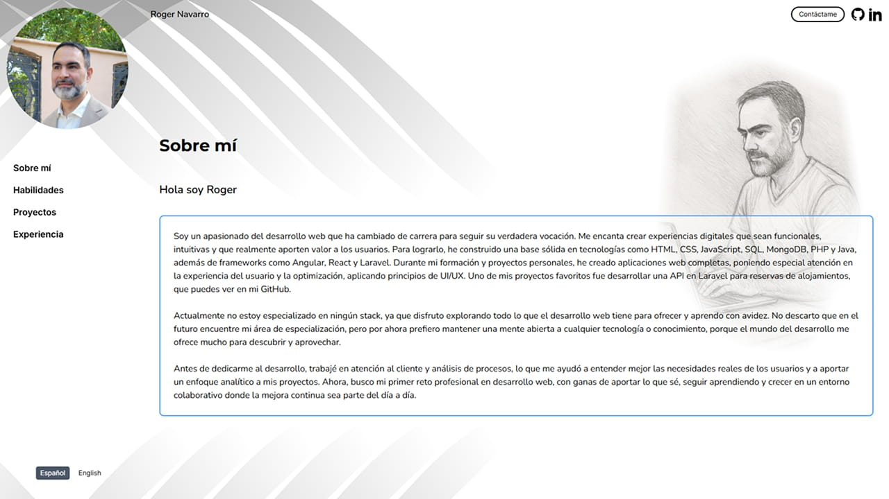

# 🌐 Personal Portfolio - Roger Navarro

Hi there! 👋  
This is my personal web developer portfolio, built with **React** and **Tailwind CSS**. It showcases my academic and personal projects, technical and soft skills, and previous experience in a clean, responsive, and multilingual format.

---

## 🚀 Tech Stack

- ⚛️ React (with hooks like `useState`, `useEffect`)
- 🎨 Tailwind CSS
- 🌍 Multilingual support (EN/ES) using a custom context
- 📁 Modular component and data structure
- 📸 Interactive image gallery with fullscreen view
- ♿ Accessibility-focused (semantic HTML, alt texts, keyboard nav)
- 🧪 Best practices with ESLint, clean scalable architecture

---

## 🧩 Sections Overview

- **About me**: My story and motivation.
- **Skills**: Technical (with badges/icons) and personal (with descriptions).
- **Projects**: Filterable list with highlight cards and modal view.
- **Contact**: Direct contact details.

---

## 📸 Interactive Gallery

Each project includes a capture gallery with clickable thumbnails and fullscreen view, with bilingual descriptions and accessible semantics using `figure`, `figcaption`, roles, and optimized navigation.

---

## 🗃️ Project Structure

The following structure gives a general overview of the main folders and files used in the project.


```bash
src/
├── components/
│   └── FullscreenImageModal.jsx
├── context/
│   └── LanguageContext.jsx
├── data/
│   ├── hard-skill-list.js
│   └── project-list.js
├── features/
│   └── projects/
│       ├── components/
│       ├── ProjectModal.jsx
│       └── ProjectCard.jsx
├── helpers/
│   └── renderProjectElements.js
└── App.jsx
```

---

## 🌐 Live Demo

Available at:  
🔗 [https://roger-portfolio.rogerdev.xyz/](https://roger-portfolio.rogerdev.xyz/)

---

## 📷 Portfolio Screenshot

<p align="center">
  
</p>

---

## 🙋 About Me

I'm a junior web developer with a background in DAW (Web App Development) and a passion for continuous learning. This portfolio aims to reflect both my technical profile and human side, combining clean code with user-focused design.

---

## 📫 Contact

- ✉️ rogernavarro.dev@gmail.com  
- 🐙 [@Roger486 on GitHub](https://github.com/Roger486)

---

### 📌 Note

This project is a work in progress. Suggestions, ideas, and feedback are welcome. Thanks for stopping by! 🙏